# FinTrack — Finance App UI/UX

A mobile personal finance app UI/UX case study designed in Figma.

## Project Overview

FinTrack is a personal finance app concept designed to help users manage their income, expenses, transactions, budgets, and spending analytics through a simple and user-friendly interface.

## UX Research

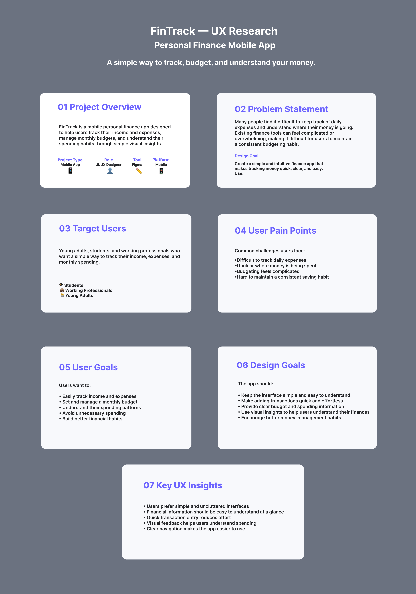

## User Flow

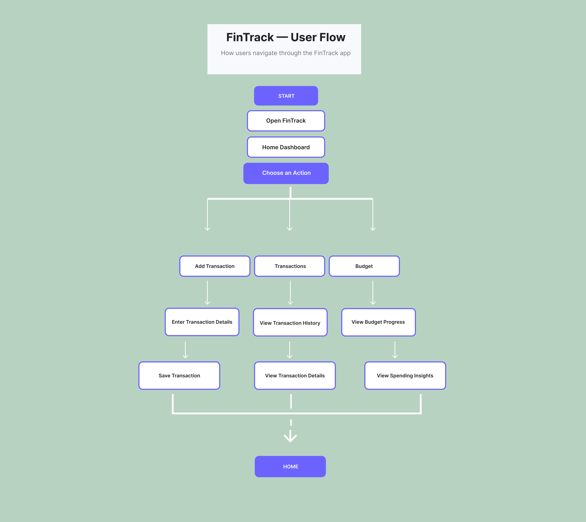

## Wireframes

### Home
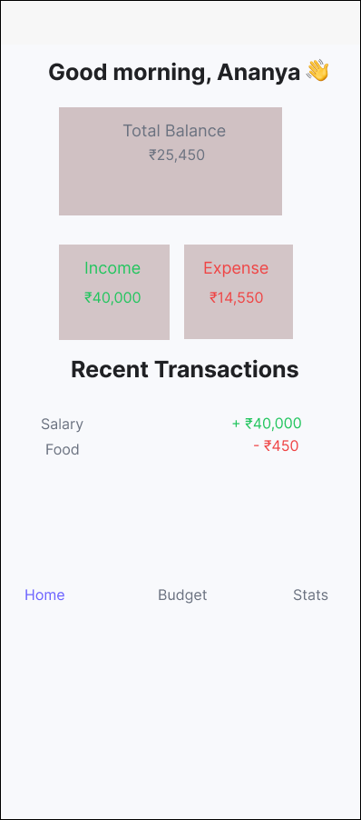

### Add Transaction

### Transactions
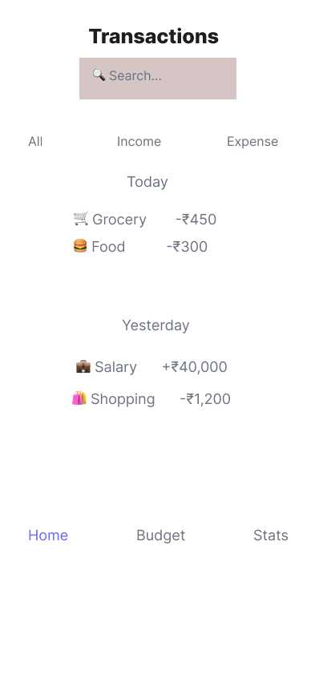

### Budget
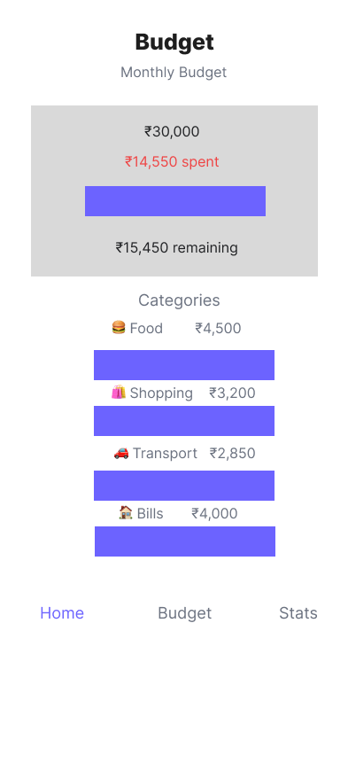

### Analytics
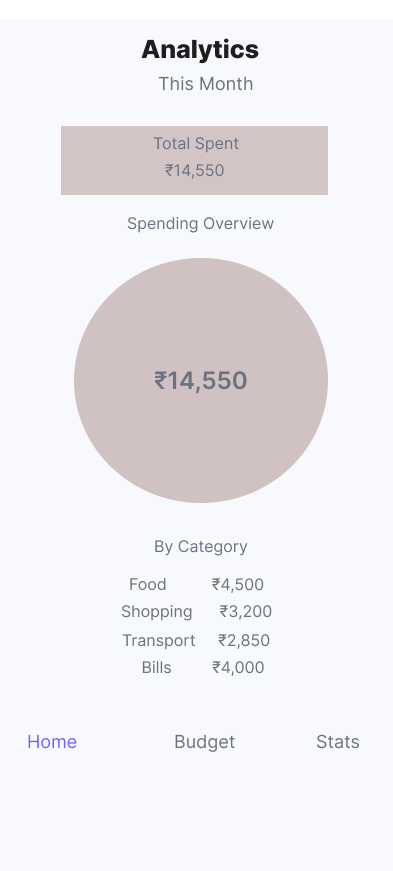

### Profile
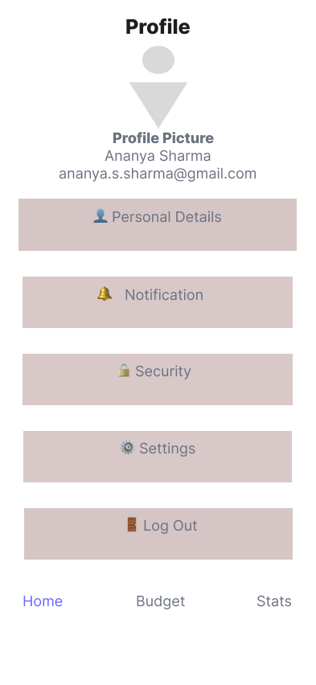

## Final UI Screens

### Home
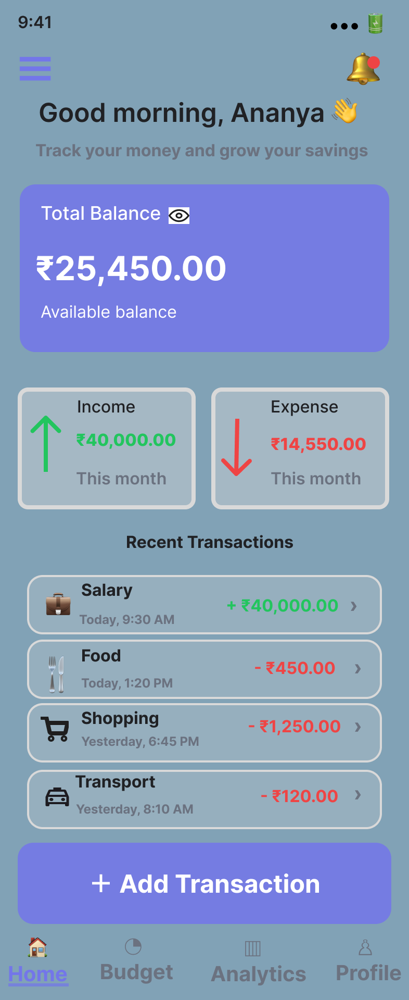

### Add Transaction
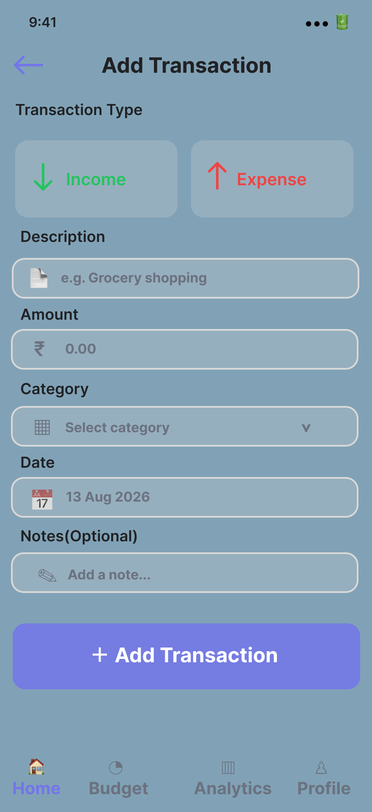

### Transactions
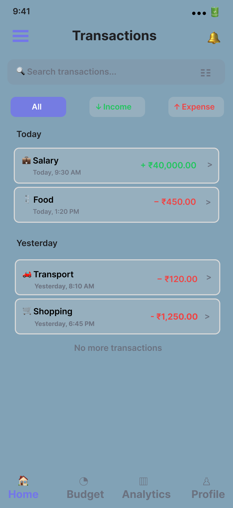

### Budget
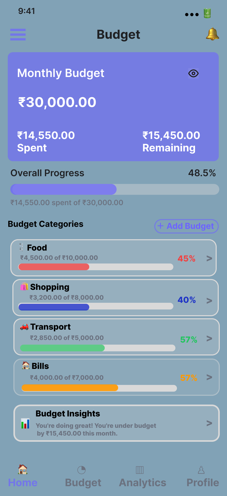

### Analytics
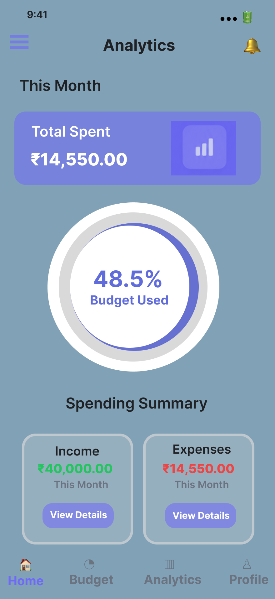

### Profile
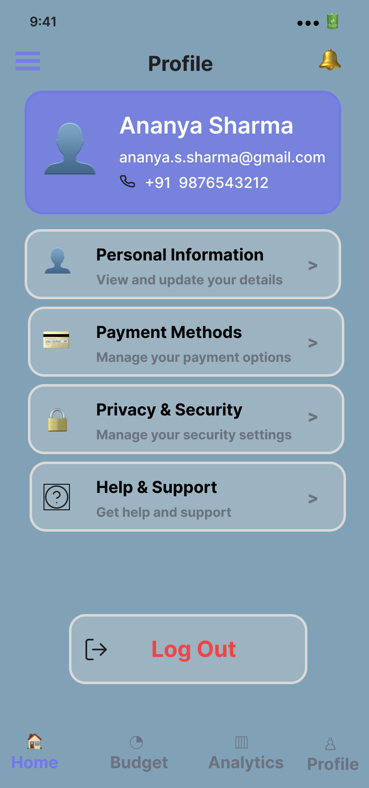

## Tools Used

- Figma
- UI/UX Design
- Wireframing
- UX Research
- User Flow Design
- High-Fidelity Prototyping

## Key Features

- Income and expense tracking
- Transaction management
- Monthly budget tracking
- Category-wise spending
- Spending analytics
- Profile and account settings

## Project Type

**UI/UX Design Case Study**
